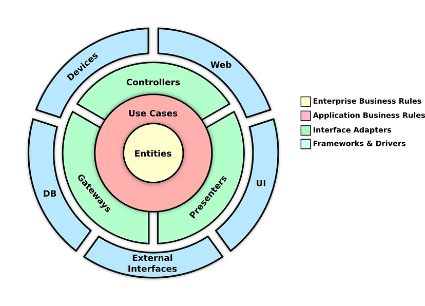

# ProdutoAPI
Estudos WebAPI Produto em .netcore

## Arquitetura de Software

### Arquitetura Clean



Há muitas formas para adaptarmos projetos para utilizar a arquitetura limpa (clean architecture), podendo ter mais ou menos camadas, nomes distintos e separações diferentes.Neste exemplo, vamos separar as camadas (layers) de modo a facilitar para os desenvolvedores do projeto, sem exagerar na complexidade, portanto, alguns pontos poderão não seguirão à risca as recomendações para a arquitetura, mas ainda assim respeitando as boas práticas.

Para este projeto, vamos separar em camadas principais:

#### Camada 'Core'
Contém os componentes que integram a camada 'Enterprise Business Rules' com 'Application Business Rules', a fim de simplificar a arquitetura. Ou seja, conterá as subcamadas das entidades do domínio e regras de negócio. É comum também ser chamada de 'Domain' ou 'Core/Domain'

#### Camada 'App'
Contém os componentes que integram as 'Interface Adapters'. Ou seja, Presenters, Controllers e Gateways serão implementados nessa camada. É muito comum esta camada ser separada em mais camadas (Application, Web ou Api, Presenter...), mas para este exemplo, vamos concentrar nela separando 'subcamadas' quando for necessário, para simplificar a arquitetura.

#### Camada 'Infra'
Contém os componentes que integram a camada de 'Frameworks & Drivers', responsáveis pelas implementações que realizam as comunicações/integrações externas à aplicação.

#### Camada 'Shared'
Também conhecida como 'CrossCutting', contém eventuais componentes que podem ser 'compartilhadas' em todas as camadas.


## Commands for creating this WebAPI project in .netcore 6

- Creating a git branch 'develop' based on main
```sh
git checkout -B develop
```

-  Creating solution project:

Como o nome do repo git já é ProdutoAPI, não vou precisar passar o arqumento '-n ProdutoAPI'
Vamos criar uma pasta 'src' para organizar onde ficarão os códigos-fontes da aplicação

```sh
dotnet new sln
mkdir src
```

-  Creating clean arch layers:

```sh
cd src
dotnet new classlib -n App
dotnet new classlib -n Core
dotnet new classlib -n Infra
dotnet new classlib -n Shared
cd ..
```

-  Associating layers with solution:

```sh
dotnet sln add src/App/App.csproj
dotnet sln add src/Core/Core.csproj
dotnet sln add src/Infra/Infra.csproj
dotnet sln add src/Shared/Shared.csproj
```

-  Creating clean arch layer's scructures:

For Core:

```sh
cd src/Core
mkdir Domain
cd Domain
mkdir Entity
mkdir Usecase
cd ..
cd ..
cd ..
```


For Application:

Creating webapi in Entrypoint:

```sh
cd src/App
dotnet new webapi -n Entrypoint
cd ../..
dotnet sln add src/App/Entrypoint/Entrypoint.csproj
```

Creating Config:

```sh
cd src/App
mkdir Config
cd ../..
```

For the example, the product can get the product's categories from other api or database

```sh
cd src/App
mkdir ProductCategory
mkdir ProductCategory/DataProvider
mkdir ProductCategory/Gateway
cd ../..
```

For Infrastructure:

For the example, the product can get the product's categories from other api or database

```sh
cd src/Infra
mkdir ProductCategory
mkdir ProductCategory/RestClient
mkdir ProductCategory/Repository
cd ../..
```

***... WIP ...***

Obs.: 

Vídeo e Projeto do engenheiro da M$: 
https://learn.microsoft.com/en-us/shows/dotnetconf-2021/clean-architecture-with-aspnet-core-6 (não foi baseado nele, mas bom material estudos)
https://github.com/ardalis/CleanArchitecture (não foi baseado nele, mas bom material estudos)


